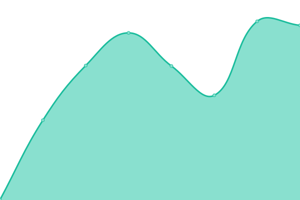
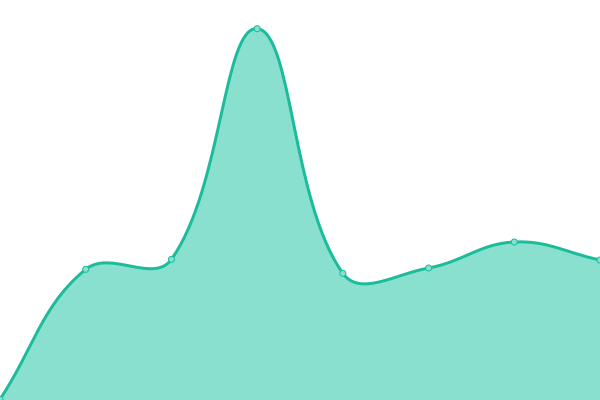
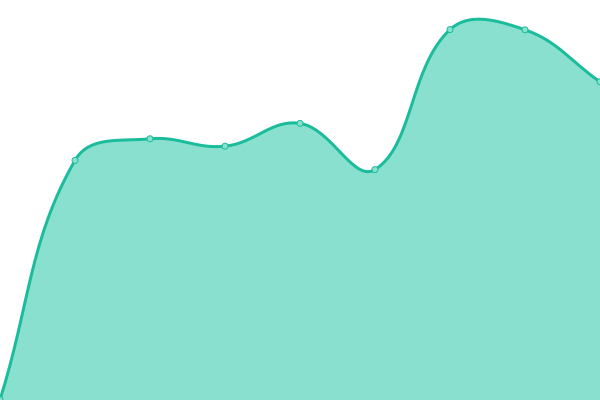
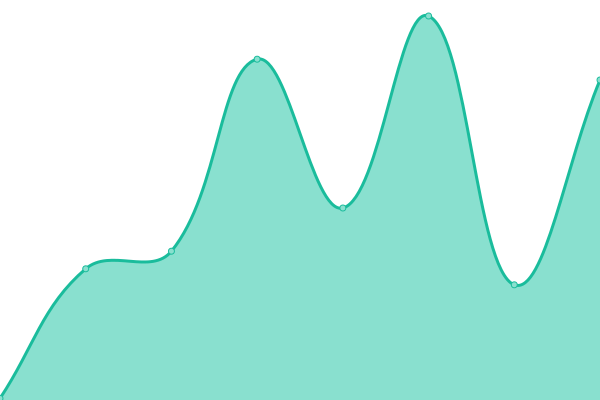
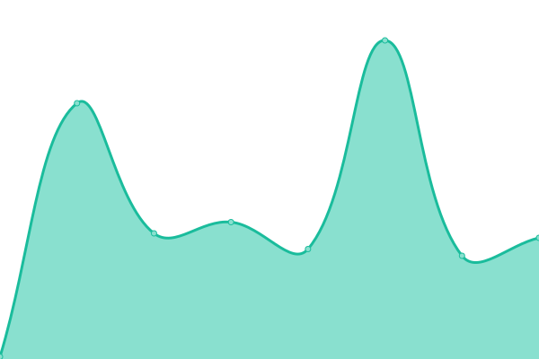
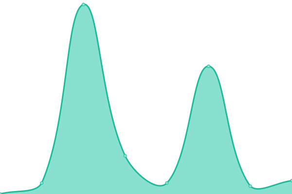
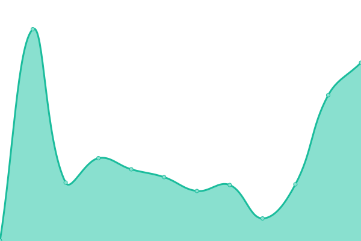
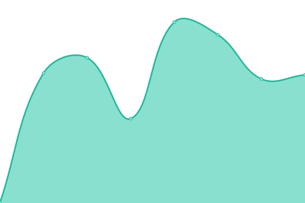
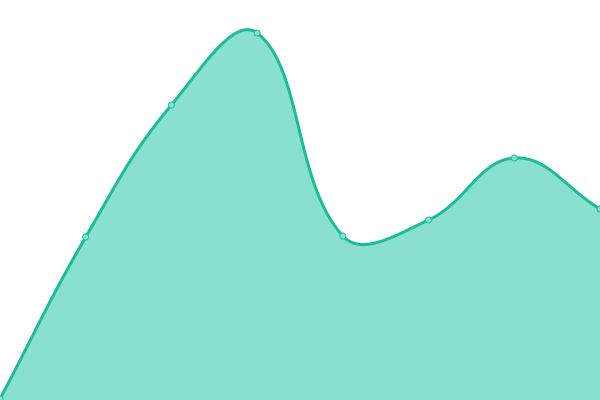

# [📈 Live Status](https://upptime.github.io/upptime): <!--live status--> **🟩 All systems operational**

This repository contains the open-source uptime monitor and status page for [Upptime](https://upptime.js.org), powered by [Upptime](https://github.com/upptime/upptime).

With [Upptime](https://upptime.js.org), you can get your own unlimited and free uptime monitor and status page, powered entirely by a GitHub repository. We use [Issues](https://github.com/upptime/upptime/issues) as incident reports, [Actions](https://github.com/alphaleadership/status/actions) as uptime monitors, and [Pages](https://upptime.github.io/upptime) for the status page.

<!--start: status pages-->
<!-- This summary is generated by Upptime (https://github.com/upptime/upptime) -->
<!-- Do not edit this manually, your changes will be overwritten -->
<!-- prettier-ignore -->
| URL | Status | History | Response Time | Uptime |
| --- | ------ | ------- | ------------- | ------ |
|  [Google](https://www.google.com) | 🟩 Up | [google.yml](https://github.com/thomas-iniguez-visioli/status/commits/HEAD/history/google.yml) | 

 115ms
     
 | 

<a href="https://thomas-iniguez-visioli.github.io/status/history/google">100.00%</a>
    

|  [grisebouille](https://grisebouille.net/) | 🟩 Up | [grisebouille.yml](https://github.com/thomas-iniguez-visioli/status/commits/HEAD/history/grisebouille.yml) | 

 712ms
     
 | 

<a href="https://thomas-iniguez-visioli.github.io/status/history/grisebouille">100.00%</a>
    

|  [Google Maps](https://maps.google.com) | 🟩 Up | [google-maps.yml](https://github.com/thomas-iniguez-visioli/status/commits/HEAD/history/google-maps.yml) | 

 212ms
     
 | 

<a href="https://thomas-iniguez-visioli.github.io/status/history/google-maps">100.00%</a>
    

|  [Google Drive](https://drive.google.com) | 🟩 Up | [google-drive.yml](https://github.com/thomas-iniguez-visioli/status/commits/HEAD/history/google-drive.yml) | 

 418ms
     
 | 

<a href="https://thomas-iniguez-visioli.github.io/status/history/google-drive">100.00%</a>
    

|  [Google Photos](https://photos.google.com) | 🟩 Up | [google-photos.yml](https://github.com/thomas-iniguez-visioli/status/commits/HEAD/history/google-photos.yml) | 

 177ms
     
 | 

<a href="https://thomas-iniguez-visioli.github.io/status/history/google-photos">100.00%</a>
    

|  [ProtonMail](https://protonmail.com) | 🟩 Up | [proton-mail.yml](https://github.com/thomas-iniguez-visioli/status/commits/HEAD/history/proton-mail.yml) | 

 2101ms
     
 | 

<a href="https://thomas-iniguez-visioli.github.io/status/history/proton-mail">100.00%</a>
    

|  [ProtonVPN](https://protonvpn.com) | 🟩 Up | [proton-vpn.yml](https://github.com/thomas-iniguez-visioli/status/commits/HEAD/history/proton-vpn.yml) | 

 1031ms
     
 | 

<a href="https://thomas-iniguez-visioli.github.io/status/history/proton-vpn">100.00%</a>
    

|  [Wikipedia](https://en.wikipedia.org) | 🟩 Up | [wikipedia.yml](https://github.com/thomas-iniguez-visioli/status/commits/HEAD/history/wikipedia.yml) | 

 158ms
     
 | 

<a href="https://thomas-iniguez-visioli.github.io/status/history/wikipedia">100.00%</a>
    

|  [Hacker News](https://news.ycombinator.com) | 🟩 Up | [hacker-news.yml](https://github.com/thomas-iniguez-visioli/status/commits/HEAD/history/hacker-news.yml) | 

 282ms
     
 | 

<a href="https://thomas-iniguez-visioli.github.io/status/history/hacker-news">100.00%</a>
    

|  [discord](https://discord.com) | 🟩 Up | [discord.yml](https://github.com/thomas-iniguez-visioli/status/commits/HEAD/history/discord.yml) | 

 108ms
     
 | 

<a href="https://thomas-iniguez-visioli.github.io/status/history/discord">100.00%</a>
    

|  [twitter](https://x.com) | 🟩 Up | [twitter.yml](https://github.com/thomas-iniguez-visioli/status/commits/HEAD/history/twitter.yml) | 

 116ms
     
 | 

<a href="https://thomas-iniguez-visioli.github.io/status/history/twitter">100.00%</a>
    

|  [twitterold](https://twitter.com) | 🟩 Up | [twitterold.yml](https://github.com/thomas-iniguez-visioli/status/commits/HEAD/history/twitterold.yml) | 

 153ms
     
 | 

<a href="https://thomas-iniguez-visioli.github.io/status/history/twitterold">100.00%</a>
    

|  [instagram](https://instagram.com) | 🟩 Up | [instagram.yml](https://github.com/thomas-iniguez-visioli/status/commits/HEAD/history/instagram.yml) | 

 822ms
     
 | 

<a href="https://thomas-iniguez-visioli.github.io/status/history/instagram">100.00%</a>
    

|  [twitch](https://twitch.tv) | 🟩 Up | [twitch.yml](https://github.com/thomas-iniguez-visioli/status/commits/HEAD/history/twitch.yml) | 

 123ms
     
 | 

<a href="https://thomas-iniguez-visioli.github.io/status/history/twitch">100.00%</a>
    

|  [github](https://github.com) | 🟩 Up | [github.yml](https://github.com/thomas-iniguez-visioli/status/commits/HEAD/history/github.yml) | 

 123ms
     
 | 

<a href="https://thomas-iniguez-visioli.github.io/status/history/github">99.87%</a>
    

|  [stack](https://stackoverflow.com) | 🟩 Up | [stack.yml](https://github.com/thomas-iniguez-visioli/status/commits/HEAD/history/stack.yml) | 

 168ms
     
 | 

<a href="https://thomas-iniguez-visioli.github.io/status/history/stack">100.00%</a>
    

|  [toutatice](https://www.toutatice.fr) | 🟩 Up | [toutatice.yml](https://github.com/thomas-iniguez-visioli/status/commits/HEAD/history/toutatice.yml) | 

 1385ms
     
 | 

<a href="https://thomas-iniguez-visioli.github.io/status/history/toutatice">99.54%</a>
    

|  [linkedin](https://www.linkedin.com) | 🟩 Up | [linkedin.yml](https://github.com/thomas-iniguez-visioli/status/commits/HEAD/history/linkedin.yml) | 

 276ms
     
 | 

<a href="https://thomas-iniguez-visioli.github.io/status/history/linkedin">100.00%</a>
    

<!--end: status pages-->

[**Visit our status website →**](https://upptime.github.io/upptime)

## 📄 License

- Powered by: [Upptime](https://github.com/upptime/upptime)
- Code: [MIT](./LICENSE) © [Anand Chowdhary](https://anandchowdhary.com), supported by [Pabio](https://pabio.com)
- Data in the `./history` directory: [Open Database License](https://opendatacommons.org/licenses/odbl/1-0/)
