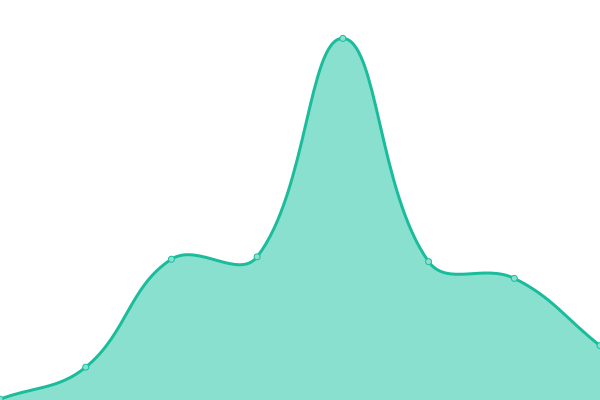

# [📈 Live Status](https://upptime.github.io/upptime): <!--live status--> **🟧 Partial outage**

This repository contains the open-source uptime monitor and status page for [Upptime](https://upptime.js.org), powered by [Upptime](https://github.com/upptime/upptime).

With [Upptime](https://upptime.js.org), you can get your own unlimited and free uptime monitor and status page, powered entirely by a GitHub repository. We use [Issues](https://github.com/upptime/upptime/issues) as incident reports, [Actions](https://github.com/alphaleadership/status/actions) as uptime monitors, and [Pages](https://upptime.github.io/upptime) for the status page.

<!--start: status pages-->
<!-- This summary is generated by Upptime (https://github.com/upptime/upptime) -->
<!-- Do not edit this manually, your changes will be overwritten -->
<!-- prettier-ignore -->
| URL | Status | History | Response Time | Uptime |
| --- | ------ | ------- | ------------- | ------ |
|  [Google](https://www.google.com) | 🟩 Up | [google.yml](https://github.com/thomas-iniguez-visioli/status/commits/HEAD/history/google.yml) | 

 93ms
     
 | 

<a href="https://thomas-iniguez-visioli.github.io/status/history/google">100.00%</a>
    

|  [Wikipedia](https://en.wikipedia.org) | 🟩 Up | [wikipedia.yml](https://github.com/thomas-iniguez-visioli/status/commits/HEAD/history/wikipedia.yml) | 

 133ms
     
 | 

<a href="https://thomas-iniguez-visioli.github.io/status/history/wikipedia">100.00%</a>
    

|  [Hacker News](https://news.ycombinator.com) | 🟩 Up | [hacker-news.yml](https://github.com/thomas-iniguez-visioli/status/commits/HEAD/history/hacker-news.yml) | 

 296ms
     
 | 

<a href="https://thomas-iniguez-visioli.github.io/status/history/hacker-news">100.00%</a>
    

|  [discord](https://discord.com) | 🟩 Up | [discord.yml](https://github.com/thomas-iniguez-visioli/status/commits/HEAD/history/discord.yml) | 

 121ms
     
 | 

<a href="https://thomas-iniguez-visioli.github.io/status/history/discord">100.00%</a>
    

|  [twitter](https://x.com) | 🟥 Down | [twitter.yml](https://github.com/thomas-iniguez-visioli/status/commits/HEAD/history/twitter.yml) | 

 242ms
     
 | 

<a href="https://thomas-iniguez-visioli.github.io/status/history/twitter">86.31%</a>
    

|  [instagram](https://instagram.com) | 🟩 Up | [instagram.yml](https://github.com/thomas-iniguez-visioli/status/commits/HEAD/history/instagram.yml) | 

 869ms
     
 | 

<a href="https://thomas-iniguez-visioli.github.io/status/history/instagram">100.00%</a>
    

|  [twitch](https://twitch.tv) | 🟩 Up | [twitch.yml](https://github.com/thomas-iniguez-visioli/status/commits/HEAD/history/twitch.yml) | 

 142ms
     
 | 

<a href="https://thomas-iniguez-visioli.github.io/status/history/twitch">100.00%</a>
    

|  [github](https://github.com) | 🟩 Up | [github.yml](https://github.com/thomas-iniguez-visioli/status/commits/HEAD/history/github.yml) | 

 146ms
     
 | 

<a href="https://thomas-iniguez-visioli.github.io/status/history/github">100.00%</a>
    

|  [stack](https://stackoverflow.com) | 🟩 Up | [stack.yml](https://github.com/thomas-iniguez-visioli/status/commits/HEAD/history/stack.yml) | 

 284ms
     
 | 

<a href="https://thomas-iniguez-visioli.github.io/status/history/stack">100.00%</a>
    

|  [toutatice](https://www.toutatice.fr) | 🟩 Up | [toutatice.yml](https://github.com/thomas-iniguez-visioli/status/commits/HEAD/history/toutatice.yml) | 

 1706ms
     
 | 

<a href="https://thomas-iniguez-visioli.github.io/status/history/toutatice">93.86%</a>
    

|  [linkedin](https://www.linkedin.com) | 🟩 Up | [linkedin.yml](https://github.com/thomas-iniguez-visioli/status/commits/HEAD/history/linkedin.yml) | 

 246ms
     
 | 

<a href="https://thomas-iniguez-visioli.github.io/status/history/linkedin">100.00%</a>
    

<!--end: status pages-->

[**Visit our status website →**](https://upptime.github.io/upptime)

## 📄 License

- Powered by: [Upptime](https://github.com/upptime/upptime)
- Code: [MIT](./LICENSE) © [Anand Chowdhary](https://anandchowdhary.com), supported by [Pabio](https://pabio.com)
- Data in the `./history` directory: [Open Database License](https://opendatacommons.org/licenses/odbl/1-0/)
