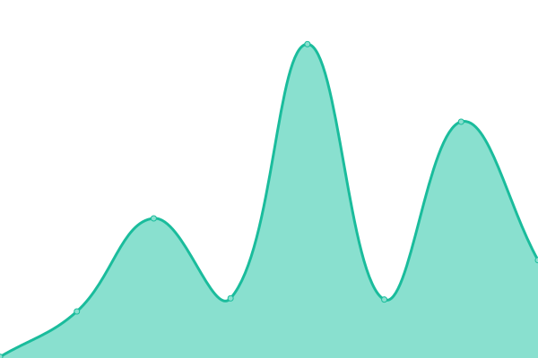
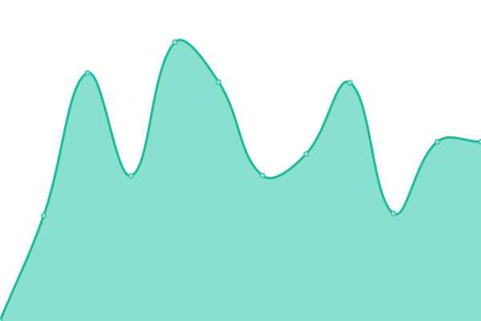
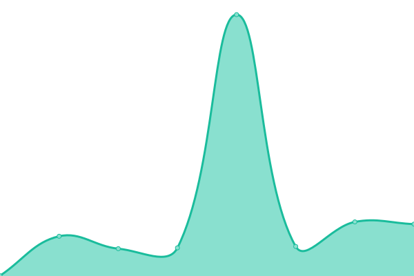
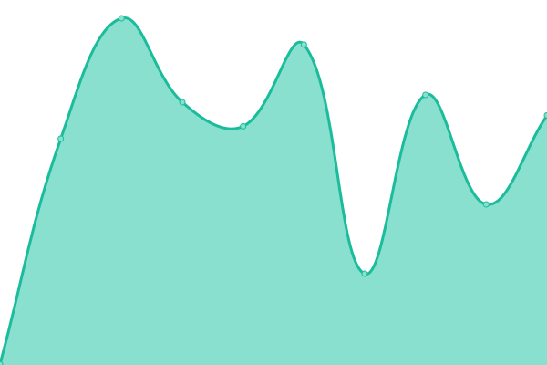

# [📈 Live Status](https://upptime.github.io/upptime): <!--live status--> **Tous les systèmes sont opérationnels**

This repository contains the open-source uptime monitor and status page for [Upptime](https://upptime.js.org), powered by [Upptime](https://github.com/upptime/upptime).

With [Upptime](https://upptime.js.org), you can get your own unlimited and free uptime monitor and status page, powered entirely by a GitHub repository. We use [Issues](https://github.com/upptime/upptime/issues) as incident reports, [Actions](https://github.com/alphaleadership/status/actions) as uptime monitors, and [Pages](https://upptime.github.io/upptime) for the status page.

<!--start: status pages-->
<!-- This summary is generated by Upptime (https://github.com/upptime/upptime) -->
<!-- Do not edit this manually, your changes will be overwritten -->
<!-- prettier-ignore -->
| URL | Status | History | Response Time | Uptime |
| --- | ------ | ------- | ------------- | ------ |
|  [Google](https://www.google.com) | En ligne | [google.yml](https://github.com/thomas-iniguez-visioli/status/commits/HEAD/history/google.yml) | 

 111ms
     
 | 

<a href="https://thomas-iniguez-visioli.github.io/status/history/google">100.00%</a>
    

|  [Wikipedia](https://en.wikipedia.org) | En ligne | [wikipedia.yml](https://github.com/thomas-iniguez-visioli/status/commits/HEAD/history/wikipedia.yml) | 

 147ms
     
 | 

<a href="https://thomas-iniguez-visioli.github.io/status/history/wikipedia">100.00%</a>
    

|  [Hacker News](https://news.ycombinator.com) | En ligne | [hacker-news.yml](https://github.com/thomas-iniguez-visioli/status/commits/HEAD/history/hacker-news.yml) | 

 323ms
     
 | 

<a href="https://thomas-iniguez-visioli.github.io/status/history/hacker-news">100.00%</a>
    

|  [discord](https://discord.com) | En ligne | [discord.yml](https://github.com/thomas-iniguez-visioli/status/commits/HEAD/history/discord.yml) | 

 116ms
     
 | 

<a href="https://thomas-iniguez-visioli.github.io/status/history/discord">100.00%</a>
    

|  [twitter](https://x.com) | En ligne | [twitter.yml](https://github.com/thomas-iniguez-visioli/status/commits/HEAD/history/twitter.yml) | 

 156ms
     
 | 

<a href="https://thomas-iniguez-visioli.github.io/status/history/twitter">100.00%</a>
    

|  [instagram](https://instagram.com) | En ligne | [instagram.yml](https://github.com/thomas-iniguez-visioli/status/commits/HEAD/history/instagram.yml) | 

 814ms
     
 | 

<a href="https://thomas-iniguez-visioli.github.io/status/history/instagram">95.26%</a>
    

|  [twitch](https://twitch.tv) | En ligne | [twitch.yml](https://github.com/thomas-iniguez-visioli/status/commits/HEAD/history/twitch.yml) | 

 222ms
     
 | 

<a href="https://thomas-iniguez-visioli.github.io/status/history/twitch">100.00%</a>
    

|  [github](https://github.com) | En ligne | [github.yml](https://github.com/thomas-iniguez-visioli/status/commits/HEAD/history/github.yml) | 

 148ms
     
 | 

<a href="https://thomas-iniguez-visioli.github.io/status/history/github">100.00%</a>
    

|  [stack](https://stackoverflow.com) | En ligne | [stack.yml](https://github.com/thomas-iniguez-visioli/status/commits/HEAD/history/stack.yml) | 

 335ms
     
 | 

<a href="https://thomas-iniguez-visioli.github.io/status/history/stack">100.00%</a>
    

|  [toutatice](https://www.toutatice.fr) | En ligne | [toutatice.yml](https://github.com/thomas-iniguez-visioli/status/commits/HEAD/history/toutatice.yml) | 

 1240ms
     
 | 

<a href="https://thomas-iniguez-visioli.github.io/status/history/toutatice">100.00%</a>
    

|  [linkedin](https://www.linkedin.com) | En ligne | [linkedin.yml](https://github.com/thomas-iniguez-visioli/status/commits/HEAD/history/linkedin.yml) | 

 369ms
     
 | 

<a href="https://thomas-iniguez-visioli.github.io/status/history/linkedin">100.00%</a>
    

<!--end: status pages-->

[**Visit our status website →**](https://upptime.github.io/upptime)

## 📄 License

- Powered by: [Upptime](https://github.com/upptime/upptime)
- Code: [MIT](./LICENSE) © [Anand Chowdhary](https://anandchowdhary.com), supported by [Pabio](https://pabio.com)
- Data in the `./history` directory: [Open Database License](https://opendatacommons.org/licenses/odbl/1-0/)
